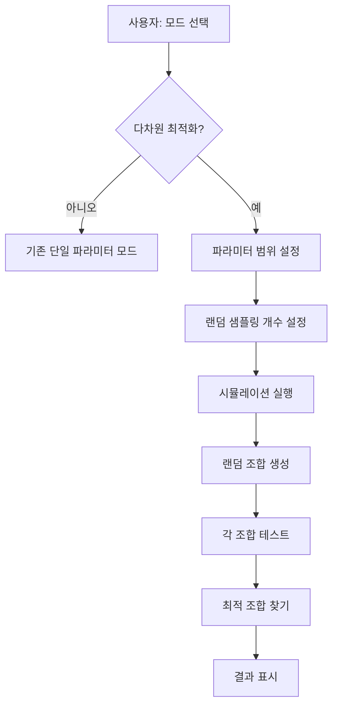

# 다차원 최적화 시뮬레이션 기능 추가

## 목표

시뮬레이션 범위만 지정하면 window_size, max_interval, confidence_skip_threshold를 동시에 최적화하여 최대 연속 불일치 5개 이하를 달성하는 최적 조합을 찾습니다.

## 구현 계획

### 1. UI 변경: 모드 선택 및 파라미터 범위 설정

**위치**: `optimal_threshold_finder_app.py` - `main()` 함수 내 시뮬레이션 설정 섹션

**변경 사항**:

- **모드 선택 라디오 버튼 추가**:
    - "단일 파라미터 최적화" (기존 방식, 기본값)
    - "다차원 최적화" (새 모드)

- **다차원 최적화 모드 활성화 시 표시할 입력 필드들**:
  ```
  ### 윈도우 크기 범위
 - 최소: number_input (5-9, 기본값 5)
 - 최대: number_input (5-9, 기본값 9)
  
  ### 최대 예측 없음 간격 범위
 - 최소: number_input (1-20, 기본값 1)
 - 최대: number_input (1-20, 기본값 20)
  
  ### 신뢰도 스킵 임계값 범위
 - 최소: number_input (0-100, 기본값 51.0)
 - 최대: number_input (0-100, 기본값 53.5)
 - 단위: number_input (0.1-10.0, 기본값 0.1)
  
  ### 랜덤 샘플링 설정
 - 샘플링 개수: number_input (10-1000, 기본값 100, help="테스트할 무작위 조합 개수")
  ```

- **조합 수 표시**: 가능한 조합 수를 계산하여 표시
- **예상 시간 계산**: 랜덤 샘플링 개수 기준으로 예상 시간 계산

### 2. 랜덤 서치 함수 구현

**새 함수**: `random_search_multi_dimensional()`

**위치**: `optimal_threshold_finder_app.py` - `simulate_single_threshold()` 함수 다음

**함수 시그니처**:

```python
def random_search_multi_dimensional(
    cutoff_id,
    window_size_range=(5, 9),
    max_interval_range=(1, 20),
    confidence_skip_range=(51.0, 53.5, 0.1),
    num_samples=100,
    method="빈도 기반",
    use_threshold=True,
    main_threshold=60,
    progress_bar=None,
    status_text=None
):
```

**동작 방식**:

1. 각 파라미터 범위에서 유효한 값 리스트 생성

      - window_size: 정수 범위
      - max_interval: 정수 범위
      - confidence_skip_threshold: 부동소수점 범위 (step 단위)

2. `random.sample()` 또는 `random.choices()`로 무작위 조합 N개 생성

      - 중복 방지를 위해 set 사용
      - 가능한 조합 수보다 샘플링 개수가 크면 경고 후 전체 조합 사용

3. 각 조합에 대해 `simulate_single_threshold()` 호출

      - 기존 함수 재사용
      - 결과에 window_size, max_interval 정보 추가 저장

4. 진행 상황 표시:

      - 현재 테스트 중인 조합 정보
      - 예상 남은 시간
      - 완료된 조합 중 최고 결과 표시

5. 반환값:
   ```python
   {
       'results': [...],  # 각 조합의 결과 리스트
       'tested_combinations': [...],  # 테스트된 (window_size, max_interval, confidence_skip_threshold) 튜플 리스트
       'total_combinations_possible': int,  # 가능한 전체 조합 수
       'total_tested': int,  # 실제 테스트한 조합 수
       'search_method': 'random_multi_dimensional'
   }
   ```


### 3. 다차원 최적값 찾기 함수

**새 함수**: `find_optimal_multi_dimensional()`

**위치**: `optimal_threshold_finder_app.py` - `find_optimal_threshold()` 함수 다음

**동작**:

- `find_optimal_threshold()`와 유사하지만 3개 파라미터 조합 기준으로 정렬
- 최대 연속 불일치 5 이하인 조합 우선 선택
- 동일한 경우: 스킵 횟수, 정확도 등으로 추가 정렬

**반환값**:

```python
{
    'optimal_combination': {
        'window_size': int,
        'max_interval': int,
        'confidence_skip_threshold': float,
        'result': {...}  # simulate_single_threshold 결과
    },
    'candidates': [...],  # 조건 만족하는 조합들
    'all_results': [...]  # 모든 결과
}
```

### 4. 시뮬레이션 실행 로직 통합

**위치**: `optimal_threshold_finder_app.py` - `main()` 함수 내 시뮬레이션 실행 섹션

**변경 사항**:

- 모드에 따라 다른 함수 호출:
    - 단일 파라미터 모드: 기존 `batch_simulate_threshold_range()` 또는 `hybrid_search_optimal_threshold()`
    - 다차원 모드: 새 `random_search_multi_dimensional()`

- 결과 처리:
    - 모드에 따라 `find_optimal_threshold()` 또는 `find_optimal_multi_dimensional()` 호출

### 5. 결과 표시 개선

**위치**: `optimal_threshold_finder_app.py` - `display_results()` 함수 (또는 결과 표시 섹션)

**다차원 모드 결과 표시**:

- 최적 조합을 명확히 표시:
    - 윈도우 크기: X
    - 최대 예측 없음 간격: Y
    - 신뢰도 스킵 임계값: Z%

- 상위 N개 조합 비교 테이블 (기본값 10개)
- 파라미터별 효과 분석:
    - 각 window_size별 평균 성능
    - 각 max_interval별 평균 성능
    - confidence_skip_threshold 분포 분석

### 6. 성능 최적화 고려사항

- **캐싱**: 동일한 (window_size, max_interval, confidence_skip_threshold) 조합 중복 실행 방지
- **조기 종료 옵션**: 조건 만족하는 조합 발견 시 일찍 종료 (옵션)
- **병렬 처리**: 가능하면 여러 조합을 동시에 테스트 (선택적, 복잡도 높음)

## 파일 변경 목록

1. `optimal_threshold_finder_app.py`:

      - UI 모드 선택 및 다차원 범위 입력 추가 (라인 ~2360-2580)
      - `random_search_multi_dimensional()` 함수 추가 (라인 ~365 이후)
      - `find_optimal_multi_dimensional()` 함수 추가 (라인 ~433 이후)
      - 시뮬레이션 실행 로직 수정 (라인 ~2580 이후)
      - 결과 표시 로직 개선 (기존 `display_results()` 함수 또는 결과 섹션)

## 예상 동작 흐름



## 주의사항

- 랜덤 서치는 확률적이므로 실행마다 다른 결과가 나올 수 있음
- 샘플링 개수가 적으면 최적 조합을 놓칠 수 있음
- 가능한 조합 수가 매우 클 수 있음 (예: 5×20×25 = 2,500개)
- 실행 시간은 샘플링 개수에 비례 (100개 샘플 = 약 100배 시간)

## 테스트 시나리오

1. 작은 범위로 테스트: window_size 5-6, max_interval 3-5, confidence_skip 51.0-52.0, 샘플 10개
2. 실제 범위로 테스트: window_size 5-9, max_interval 1-20, confidence_skip 51.0-53.5, 샘플 100개
3. 결과 검증: 찾은 최적 조합이 실제로 조건을 만족하는지 확인
