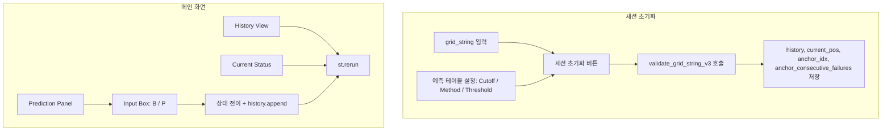

# 실시간 앵커 검증 및 피드백 시스템 앱 구현 계획

## 1. 목표 및 범위

- **목표**: 사용자가 grid_string을 입력하면 **검증 히스토리 전수 계산** 후 표시하고, **현재 상태**(앵커/윈도우/연속 실패)와 **다음 예측값**을 명시적으로 노출하며, B/P 입력 시 즉시 반영·갱신하는 대화형 UI 제공.
- **범위**: 새 Streamlit 앱 파일 1개만 추가. **코드 의존성 제거** — 다른 모듈/앱을 import하지 않고, 필요한 함수·로직은 모두 해당 앱 파일 내부에 복제한다. **허용 의존성은 데이터베이스만**: `change_point/change_point_ngram.db` (SQLite)에 대한 연결·쿼리만 사용한다. 이 한 파일로 독립 실행 가능해야 한다.

---

## 2. 요구사항–구현 매핑

| 요구사항 | 구현 방안 |
|----------|-----------|
| **[REQ-401]** 기존 스트링 입력 시 검증 히스토리 전수 계산·표시 | 그리드 입력 후 "세션 초기화" 시 `validate_grid_string_v3()` 호출 → 반환된 `history`를 **History View** 표에 그대로 사용 |
| **[REQ-402]** 현재 상태 특정 (앵커, 윈도우 9~14 단계) | 검증 결과의 `final_current_pos`, `final_anchor_idx`, `final_anchor_consecutive_failures` 및 `predict_for_position_v3()`의 `window_size`를 **Current Status** 패널에 표시 |
| **[REQ-501]** 다음 검증할 윈도우 크기 + 예측값 노출 | `predict_for_position_v3()` 결과로 문구 생성: "현재 앵커(Index N) 기준, 윈도우 W단계 검증 중입니다. 다음 예측값은 **[예측값]**입니다." → **Prediction Panel**에 강조 표시 |
| **[REQ-502]** 3연패/적중 시 새 앵커 + 윈도우 9 예측 안내 | B/P 입력 후 상태 전이 시, 다음 호출의 `predict_for_position_v3()`가 자동으로 새 앵커·윈도우 9를 사용. 필요 시 상태 전이 직후 문구로 "새 앵커(Index M), 윈도우 9 예측: **[값]**" 추가 표시 |
| **[REQ-601]** 실제 결과 B/P 입력 시 grid_string 끝에 추가 | 기존 라이브 게임과 동일: `new_grid_string = grid_string + actual_value` 후 `st.rerun()` |
| **[REQ-602]** 입력값과 예측값 비교 → 일치 시 앵커 종료/다음 앵커, 불일치 시 다음 윈도우 또는 3회 시 앵커 교체 | change_point_live_game_app_v3.py 831~994줄 부근의 B/P 버튼 핸들러와 동일한 전이 로직 재사용 (current_pos, anchor_idx, anchor_consecutive_failures 업데이트) |
| **[REQ-603]** 결과에 따라 히스토리 대시보드 즉시 갱신 | B/P 입력 후 `game_state['history'].append(...)` 및 `st.rerun()`으로 History View가 새 스텝까지 포함해 다시 그려지도록 함 |

---

## 3. 의존성 제거 및 앱 내 복제 로직

- **원칙**: 다른 `.py` 모듈·앱에서 import 하지 않는다. 필요한 동작은 모두 새 앱 파일 안에 구현(복제)한다. **허용되는 외부 의존은 DB 파일 하나** (`change_point_ngram.db`)에 대한 SQLite 연결·쿼리뿐이다.
- **앱 내에 반드시 포함·복제할 로직**:
  - **DB 연결**: `get_db_connection()` — 앱 파일 위치(`__file__`) 기준으로 `change_point_ngram.db` 경로를 계산해 `sqlite3.connect(..., timeout=20)` 반환. (svg_parser_module 326~343줄의 경로·연결 로직을 복제하여 모듈 import 없이 동일 동작 구현.)
  - **앵커 계산**: `detect_change_points(grid_string)`, `update_anchors_after_input(grid_string)` — 변화점 감지 및 입력 후 앵커 재계산. 라이브 게임 앱 55~62, 106~110줄 부근 복제.
  - **전수 검증**: `validate_grid_string_v3(...)` — 첫 앵커부터 현재 시점까지 검증, `history`·`final_current_pos`·`final_anchor_idx`·`final_anchor_consecutive_failures` 반환. 쿼리 대상은 `simulation_predictions_change_point`. 라이브 게임 앱 114~327줄 부근 논리를 그대로 앱 내에 복제.
  - **다음 예측**: `predict_for_position_v3(...)` — 다음 검증 포지션의 예측값·윈도우·앵커 정보 반환. 라이브 게임 앱 330~506줄 부근 논리 복제.
  - **B/P 피드백 후 상태 전이**: grid_string 추가 → 앵커 재계산 → RULE-1/RULE-2에 따른 `current_pos`·`anchor_idx`·`anchor_consecutive_failures` 갱신. 라이브 게임 앱 831~994줄 부근 버튼 핸들러 로직을 앱 내 함수(예: `apply_feedback_and_advance_state(...)`)로 묶어 복제.
- **예측 테이블 생성**: 이 앱에서는 구현하지 않는다. 테이블은 **선행**으로 다른 도구에서 채워져 있다고 가정. 앱 시작 시 레코드 유무만 확인, 비어 있으면 안내만.
- **Cutoff ID·Method·Threshold**: 예측 조회 시 사용. Cutoff ID 목록은 DB에서 `SELECT id FROM preprocessed_grid_strings ORDER BY id`로 읽어 드롭다운에 채운다. Method/Threshold는 앱 내 고정 옵션 또는 UI 입력.

---

## 3.1. 예측 테이블과 실시간 검증의 분리 (불변성)

- **예측 테이블 생성은 선행**: 실시간 검증을 시작하기 **전에** 예측 테이블이 이미 생성·설정되어 있어야 한다. 실시간 검증 로직이 예측 테이블 생성/갱신에 관여하면 안 된다.
- **실시간 검증은 예측 테이블에 영향을 주지 않음**: 검증 중 B/P 입력, 히스토리 갱신, 앵커 전이 등 어떤 동작도 `simulation_predictions_change_point` (및 관련 설정)를 **수정·재생성하지 않는다**. 앱은 해당 테이블을 **읽기 전용**으로만 사용한다.
- **초기화 시 예측 테이블은 유지**: "세션 초기화" 또는 "새 스트링으로 초기화" 시 바꾸는 것은 **세션 상태만**이다 — 예: `grid_string`, `history`, `current_pos`, `anchor_idx`, `anchor_consecutive_failures` 등. **예측 테이블 및 사용 중인 Cutoff ID·Method·Threshold 선택은 변경하지 않는다.**
- **새 스트링 검증이어도 예측 테이블 불변**: 한 스트링에 대한 검증이 끝난 뒤 초기화하고, 다른 스트링으로 실시간 검증을 시작해도, **예측 테이블은 그대로 유지**된다. 사용자가 별도로 예측 테이블을 다시 생성하거나 설정을 바꿀 때까지 동일한 테이블·설정이 계속 사용된다.

---

## 4. UI 구성 (제안 컴포넌트별)

- **History View**: 이전까지 완료된 **앵커별 성공/실패** 요약 표.
  - 요구 "앵커별 기록"을 위해 `history`를 앵커 단위로 집계한 보조 테이블 추가 권장: 컬럼 예) `앵커 인덱스`, `앵커 위치`, `결과(성공/실패)`, `마지막 윈도우`, `관련 스텝 번호`.
  - 상세가 필요하면 기존처럼 스텝별 테이블(Step, Position, Anchor, Window, 예측, 실제값, 일치 여부 등)도 유지.
- **Current Status**:  
  - 현재 추적 중인 **앵커 위치**(인덱스 및 grid 내 위치),  
  - **사용 중인 윈도우 크기**(9~14 중 현재 스텝에서 쓰이는 값, `predict_for_position_v3`의 `window_size`),  
  - **연속 실패 횟수** `anchor_consecutive_failures`.
- **Prediction Panel**:  
  - 한 문단으로 **"현재 앵커(Index N) 기준, 윈도우 W단계 검증 중입니다. 다음 예측값은 **[예측값]**입니다."**  
  - 예측값은 강조(예: 큰 글꼴·색상). 예측 불가/스킵이면 "다음 예측값 없음" 또는 "스킵" 등으로 표시.
- **Input Box**:  
  - "실제 결과(B/P)" 라벨의 **B / P 버튼**.  
  - [REQ-601][REQ-602][REQ-603] 반영: 클릭 시 `grid_string` 끝에 문자 추가 → 비교 → 상태 전이 → `history` append → `st.rerun()`.

---

## 5. 데이터 흐름 요약

1. **선행**: 예측 테이블은 이미 생성·설정되어 있어야 함. (이 앱에서는 생성하지 않음. 외부 도구 선행.)
2. **초기화**: 사용자가 grid_string 입력 후 "세션 초기화" 클릭 → `validate_grid_string_v3(...)` 호출 → `history`, `final_current_pos`, `final_anchor_idx`, `final_anchor_consecutive_failures`를 **세션 상태만** 저장. **예측 테이블 및 Cutoff/Method/Threshold 설정은 변경하지 않음.**
3. **현재 상태·예측**: 저장된 상태로 `predict_for_position_v3(..., current_pos, anchor_idx, anchor_consecutive_failures)` 호출 → Current Status / Prediction Panel 내용 결정. (예측 테이블은 읽기만 함.)
4. **피드백**: B/P 클릭 → actual 반영, 비교, RULE-1/RULE-2에 따라 `current_pos`/`anchor_idx`/`anchor_consecutive_failures` 갱신 → `history`에 1건 append → `st.rerun()`. (예측 테이블은 수정하지 않음.)
5. **갱신 후**: 새 상태로 다시 3·4번 실행되어 "다음 앵커 + 윈도우 9" 등이 자연스럽게 [REQ-502] 형태로 표시됨.
6. **새 스트링으로 초기화**: 검증이 끝난 뒤 "초기화" 시 **세션 상태만** 리셋(새 grid_string, 새 history, current_pos/anchor_idx 등). **예측 테이블은 그대로 유지**되어, 새 스트링에 대한 실시간 검증도 동일한 예측 테이블로 진행된다.

---

## 6. 파일 및 의존성 (DB만, 독립 실행)

- **추가 파일**: `change_point/change_point_live_anchor_feedback_app.py` — 이 한 파일만 추가하며, **다른 Python 모듈/앱을 import 하지 않는다**.
- **허용 의존성**: **데이터베이스만**. 사용하는 DB는 `change_point/change_point_ngram.db` (SQLite) 하나다. 앱 내부에 DB 연결용 함수를 두고, `__file__` 기준으로 위 DB 경로를 찾아 연결한다. (프로젝트 루트에서 `streamlit run change_point/change_point_live_anchor_feedback_app.py` 또는 `change_point` 폴더 내에서 실행해도 동일 DB를 참조하도록 경로 처리.)
- **사용하는 DB 객체**:  
  - **읽기**: `simulation_predictions_change_point` (예측 조회), `preprocessed_grid_strings` (Cutoff ID 목록·테이블 존재 여부 확인).  
  - **쓰기**: 이 앱에서는 DB에 **쓰지 않는다**. 예측 테이블 채우기·갱신은 모두 선행 단계(외부 도구)에서만 이루어지며, 실시간 검증·초기화 시 예측 테이블은 **절대 변경되지 않는다**.
- **독립 실행**: `streamlit run change_point/change_point_live_anchor_feedback_app.py` 로만 실행 가능해야 하며, `change_point_live_game_app_v3`·`change_point_hypothesis_module`·`svg_parser_module`·`change_point_prediction_module` 등은 실행 경로에 있지 않아도 동작해야 한다.

---

## 7. 구현 시 유의사항

- **예측 테이블**: 이 앱은 예측 테이블을 생성·수정하지 않는다. 선행으로 설정된 테이블을 읽기만 함. 실시간 검증 중·초기화 시에도 예측 테이블은 변경되지 않는다. `simulation_predictions_change_point`가 비어 있으면 안내만 표시.
- **최소 길이**: 첫 앵커 0, 최소 윈도우 9 기준으로 `len(grid_string) >= 8` 등 기존와 동일한 최소 길이 검사 유지.
- **표시 값**: DB 예측값이 `'b'/'p'`일 경우, 요구 예시처럼 "Banker"/"Player"로 매핑해 노출할지 여부는 앱 설정(토글/옵션)으로 두면 된다.
- **REQ-502**: "새 앵커 + 윈도우 9"는 상태 전이 후 다음 `predict_for_position_v3()` 호출 결과로 자동 반영되므로, 별도 메시지(예: "앵커가 바뀌었습니다. 윈도우 9 예측: **…**")를 넣을 경우, `anchor_idx` 또는 `current_pos`가 직전 대비 변경된 경우에만 그 문구를 보여주면 충분함.

---

## 8. 작업 순서 제안

1. **앱 파일 생성 및 DB 연결 복제**  
   - 앱 내에 `get_db_connection()` 정의 — `__file__` 기준으로 `change_point_ngram.db` 경로 계산 후 `sqlite3.connect(..., timeout=20)` 반환. 다른 모듈 import 없이 동작.

2. **앵커·검증·예측 로직 앱 내 복제**  
   - `detect_change_points`, `update_anchors_after_input` 복제. `validate_grid_string_v3` — 라이브 게임 앱 114~327줄 부근 로직을 앱 내에 복제. `predict_for_position_v3` — 330~506줄 부근 로직 복제. B/P 상태 전이 로직을 `apply_feedback_and_advance_state(...)` 형태로 앱 내에 구현.

3. **History View 구현**  
   - 스텝별 테이블 + (선택) 앵커별 요약 테이블.

4. **Current Status / Prediction Panel / Input Box 구현**  
   - `predict_for_position_v3` 결과로 Current Status·Prediction 문구 생성, B/P 버튼과 `apply_feedback_and_advance_state` 연결, [REQ-603] 갱신 확인.

5. **DB만 사용하는 설정 UI**  
   - Cutoff ID·Method·Threshold 선택 및 "예측값 테이블 생성" 버튼 추가, 기존 라이브 게임과 동일한 조건에서 동작하도록 연결.

6. **엣지 케이스**  
   - 앵커 없음, 예측 스킵, 마지막 앵커 이후 등에서 문구·버튼 비활성화 처리.

이 순서로 진행하면 REQ-401~603과 제안 UI를 만족하는 "실시간 앵커 검증 및 피드백 시스템" 앱을 다른 모듈에 대한 의존 없이, DB만 사용하는 독립 실행 가능한 앱을 구현할 수 있다.
